# SCI Figure Toolkit

<p align="center">
  <strong>🔬 SCI Figure Toolkit</strong>
</p>

<p align="center">
  <strong>科研论文图表质量控制工具包</strong><br>
  Publication-Ready Figure Quality Control for Scientific Research
</p>

<p align="center">
  <a href="#features">Features</a> •
  <a href="#installation">Installation</a> •
  <a href="#quick-start">Quick Start</a> •
  <a href="#documentation">Documentation</a> •
  <a href="#journal-standards">Journal Standards</a>
</p>

---

## Overview

**SCI Figure Toolkit** 是一个专为科研工作者设计的 Python 工具包，帮助您：

1. **📏 遵循期刊标准** - 内置 Nature, Science, Cell 等顶刊的图表规范
2. **🔍 自动质量检查** - 检测常见问题（图例遮挡、字体不一致、尺寸不规范等）
3. **🛠️ 快速修复工具** - 一键应用标准样式，批量修复问题
4. **📚 最佳实践指南** - 从真实案例中总结的设计模式

## Features

### 🎯 Core Features

| Feature | Description |
|---------|-------------|
| **Standards Library** | 内置多个顶级期刊的图表规范 |
| **Auto Auditor** | 自动检测 10+ 种常见图表问题 |
| **Style Presets** | 一键应用期刊标准样式 |
| **Legend Patterns** | 6 种图例布局模式 (Pattern A-F) |
| **Smart Labels** | 智能标签放置（柱状图、参考线等） |

### 🔬 Supported Journals

- Nature / Nature Communications
- Science / Science Advances
- Cell / Cell Reports
- PNAS
- ACS Journals (JACS, Nano Letters, etc.)
- RSC Journals
- Elsevier Journals
- Wiley Journals
- IEEE Journals
- Custom (自定义规范)

## Installation

### From PyPI (Coming Soon)

```bash
pip install sci-figure-toolkit
```

### From Source

```bash
git clone https://github.com/caizi333333/SCIFIG.git
cd SCIFIG
pip install -e .
```

### Requirements

- Python >= 3.8
- matplotlib >= 3.5
- numpy >= 1.20

## Quick Start

### 1. Apply Journal Style

```python
from sci_figure_toolkit import set_style, FigureSpec

# Apply Nature style globally
set_style('nature')

# Or get specifications for custom use
spec = FigureSpec.from_journal('nature')
print(f"Single column width: {spec.width_single} inches")
```

### 2. Create Standard Figure

```python
from sci_figure_toolkit import create_figure

# Create a publication-ready figure
fig, axes = create_figure(
    nrows=1, ncols=3,
    width='double',      # 'single', '1.5col', 'double'
    journal='nature'
)

# Your plotting code...
for ax in axes:
    ax.plot(x, y)

# Save with proper DPI
fig.savefig('figure1.pdf', dpi=600)
```

### 3. Auto-Audit Existing Figure

```python
from sci_figure_toolkit import FigureAuditor

# Load and audit existing figure
auditor = FigureAuditor(journal='nature')
issues = auditor.audit('path/to/figure.py')

# Print report
auditor.report()

# Auto-fix common issues
auditor.fix(output='figure_fixed.py')
```

### 4. Use Design Patterns

```python
from sci_figure_toolkit import UnifiedLegend, InlineLabel

# Pattern B: Unified bottom legend
fig, axes = create_figure(1, 3)
# ... plotting ...
UnifiedLegend.apply(fig, axes, ncol=3)

# Pattern F: Inline labels on reference lines
ax.axhline(0.9, color='red', linestyle='--')
InlineLabel.add(ax, y=0.9, text='Threshold', color='red')
```

## Documentation

### 📖 User Guide

- [Getting Started](docs/getting-started.md)
- [Journal Standards Reference](docs/journal-standards.md)
- [Design Patterns Guide](docs/design-patterns.md)
- [API Reference](docs/api-reference.md)

### 📋 Issue Catalog

| Issue | Severity | Auto-Fix | Description |
|-------|----------|----------|-------------|
| Redundant Legends | ⚠️ Warning | ✅ Yes | 多子图重复图例 |
| Data Occlusion | 🔴 Error | ⚠️ Partial | 图例/标注遮挡数据 |
| Font Inconsistency | ⚠️ Warning | ✅ Yes | 字体大小不一致 |
| Non-standard Size | ℹ️ Info | ✅ Yes | 图表尺寸不规范 |
| Bar Label Placement | ⚠️ Warning | ✅ Yes | 柱状图标签位置 |
| Missing DPI | ⚠️ Warning | ✅ Yes | 输出分辨率不足 |

### 🎨 Design Patterns

| Pattern | Name | Use Case |
|---------|------|----------|
| A | Individual Legends | 每个子图内容不同 |
| **B** | **Unified Bottom** | **推荐：多子图共享图例** |
| C | Unified Right | 垂直排列子图 |
| D | No Legend | 自解释图表 |
| **E** | **Title Annotation** | **推荐：数值信息移至标题** |
| **F** | **Inline Label** | **推荐：参考线直接标注** |

## Examples

### Example 1: Multi-panel Figure with Unified Legend

```python
from sci_figure_toolkit import create_figure, UnifiedLegend

fig, axes = create_figure(1, 3, journal='nature')

colors = ['#2ecc71', '#3498db', '#e74c3c']
labels = ['0.1 Hz', '1.0 Hz', '10.0 Hz']

for i, ax in enumerate(axes):
    for j, (c, l) in enumerate(zip(colors, labels)):
        ax.plot(x, y[j], color=c, label=l if i == 0 else None)
    ax.set_title(f'({chr(97+i)}) Panel {i+1}')

# Apply unified legend at bottom
UnifiedLegend.apply(fig, axes, ncol=3)
fig.savefig('example1.pdf')
```

### Example 2: Bar Chart with Smart Labels

```python
from sci_figure_toolkit import create_figure, smart_bar_labels

fig, ax = create_figure(1, 1, width='single')

values = [0.85, -0.12, 0.45, -0.03]
bars = ax.bar(['A', 'B', 'C', 'D'], values)

# Smart labels: positive above, negative below
smart_bar_labels(ax, bars, values)
fig.savefig('example2.pdf')
```

### Example 3: Reference Lines with Inline Labels

```python
from sci_figure_toolkit import create_figure, InlineLabel

fig, ax = create_figure(1, 1)
ax.plot(x, y)

# Add reference line with inline label (no legend needed)
ax.axhline(0.9, color='red', linestyle='--')
InlineLabel.add(ax, y=0.9, text='Target', color='red')

fig.savefig('example3.pdf')
```

## Case Studies

Real-world examples from published papers showing before/after comparisons:

### Case 1: Redundant Legends → Pattern B

**Problem**: Each subplot has identical legends (3x redundancy)

| Before | After |
|--------|-------|
| 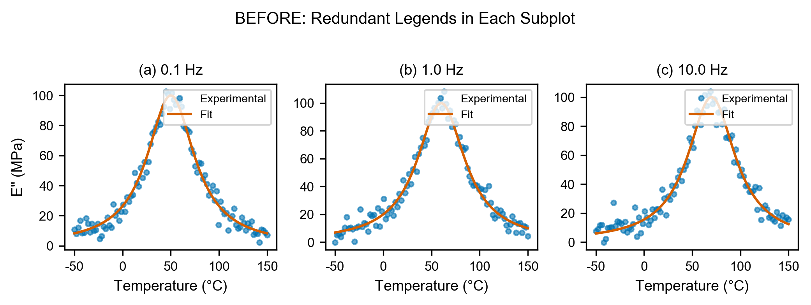 | 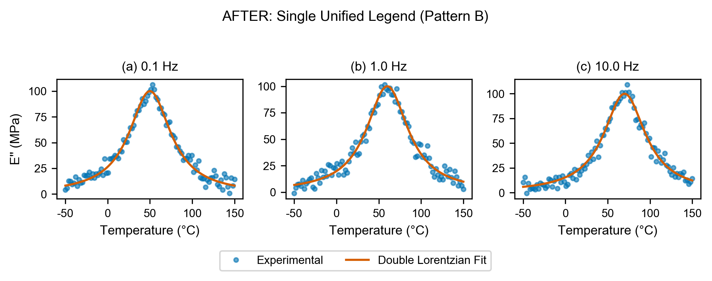 |

### Case 2: Data Occlusion → Pattern E

**Problem**: Yellow warning box covers data curves

| Before | After |
|--------|-------|
| 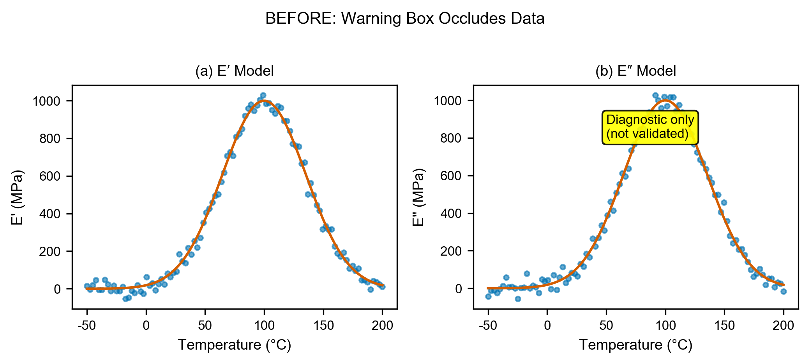 | 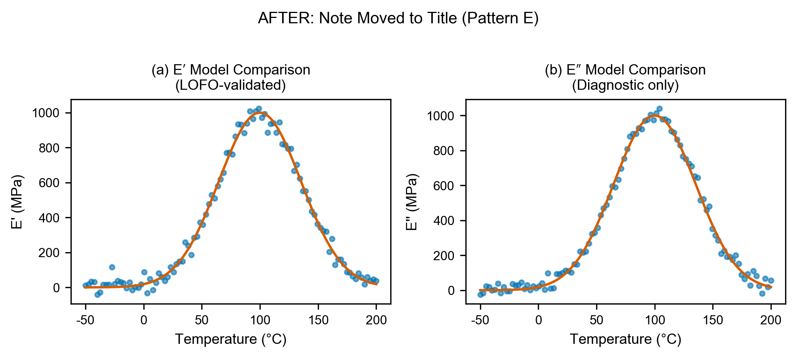 |

### Case 3: Broken Annotations → Pattern E

**Problem**: Truncated format string shows ".0e" instead of value

| Before | After |
|--------|-------|
| 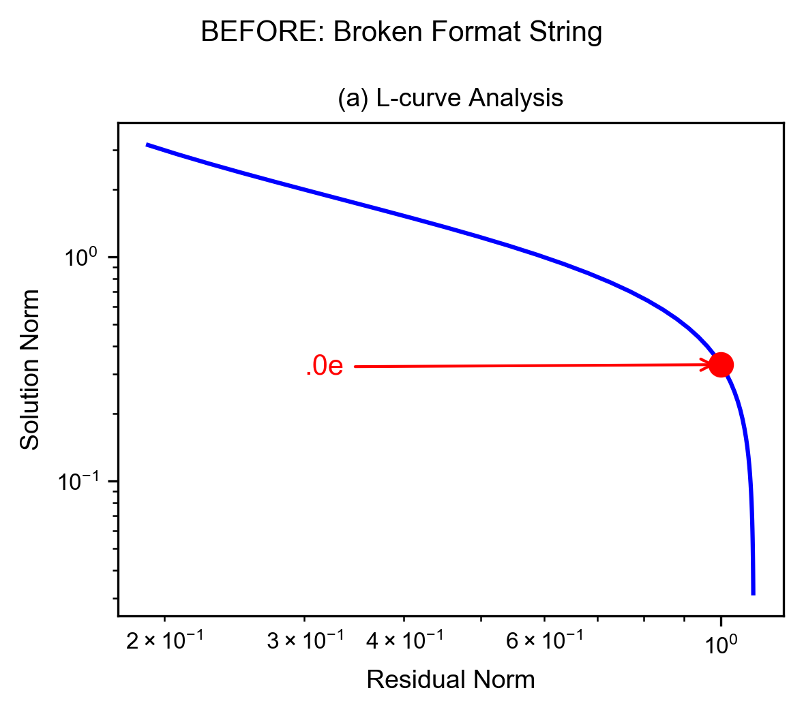 | 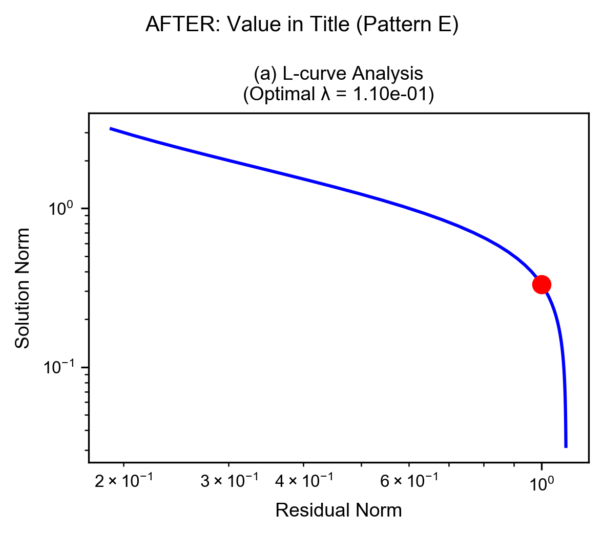 |

### Case 4: Reference Line Labels → Pattern F

**Problem**: Text label in corner occludes data

| Before | After |
|--------|-------|
|  | 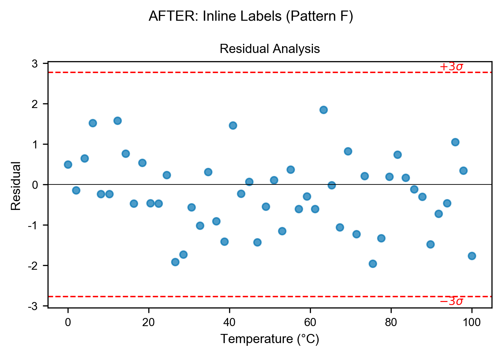 |

### Case 5: Bar Chart Labels → Smart Labels

**Problem**: Negative bar labels invisible (white text on short bar)

| Before | After |
|--------|-------|
| 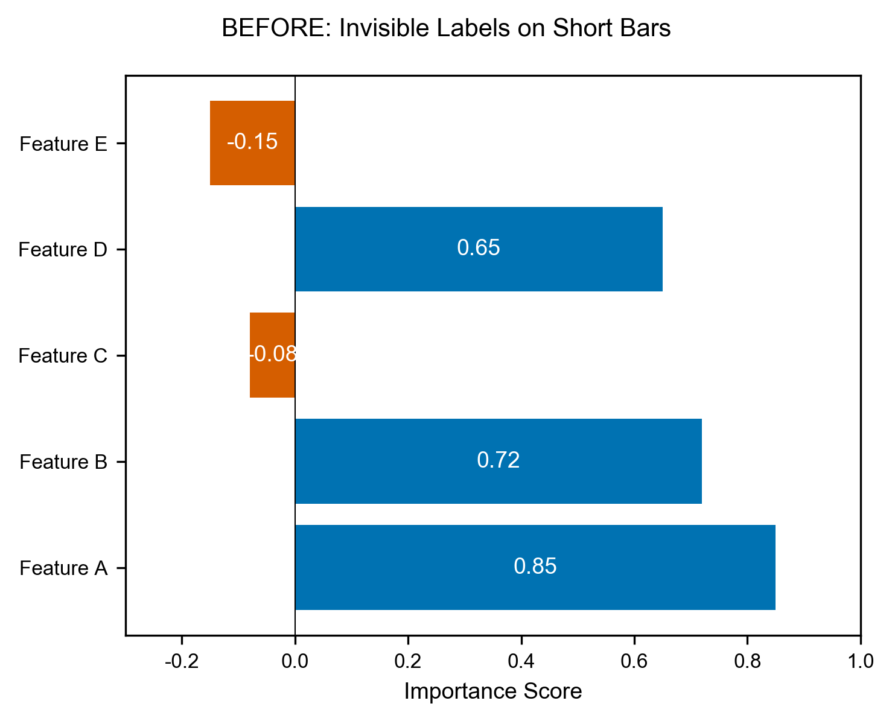 |  |

### Case 6: Font Inconsistency → Standardized Fonts + Pattern E

**Problem**: Mixed font sizes (14pt, 8pt, 12pt, etc.) across figure elements, plus arrow annotation that could occlude data

| Before | After |
|--------|-------|
| 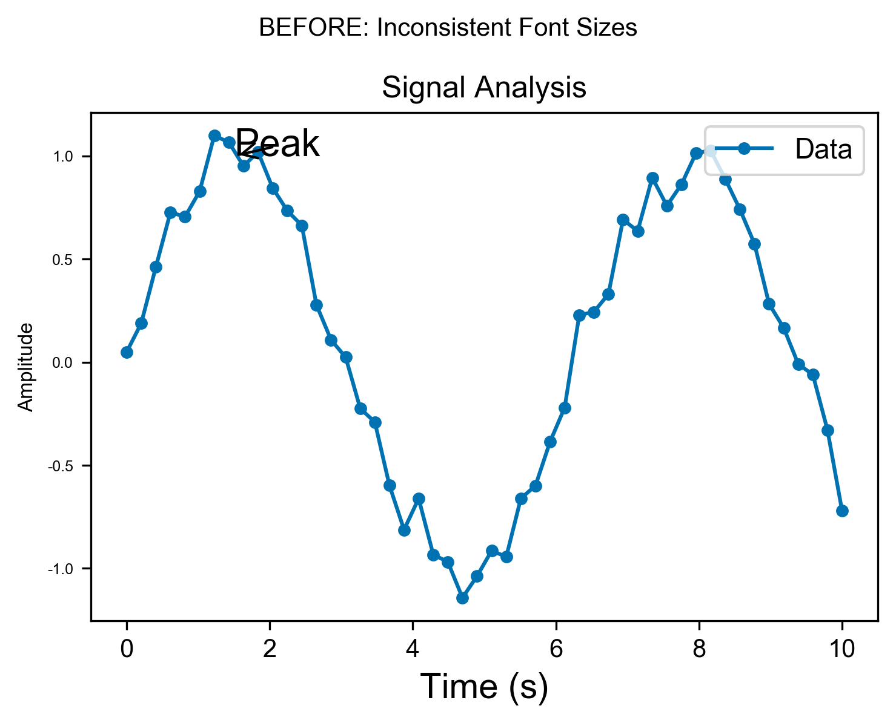 | 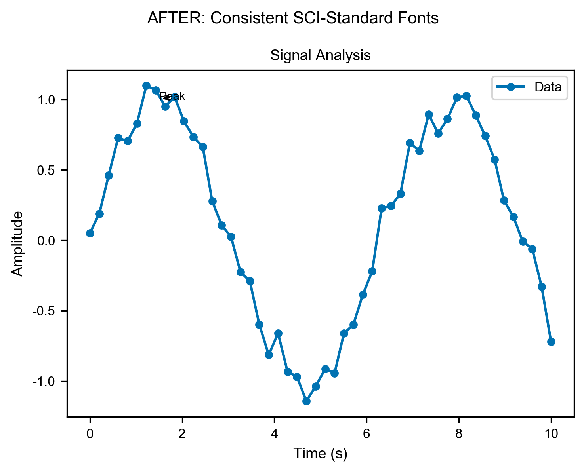 |

### Case 7: Non-Standard Figure Size → Journal Standard

**Problem**: Arbitrary 10" width doesn't match journal requirements

| Before | After |
|--------|-------|
| 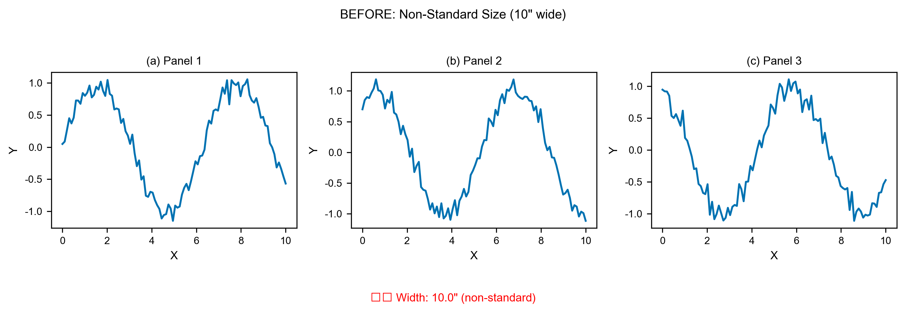 |  |

### Case 8: Low DPI Output → Publication Quality

**Problem**: 72 DPI screen resolution appears pixelated in print

| Before | After |
|--------|-------|
| 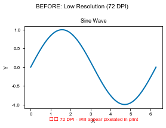 | 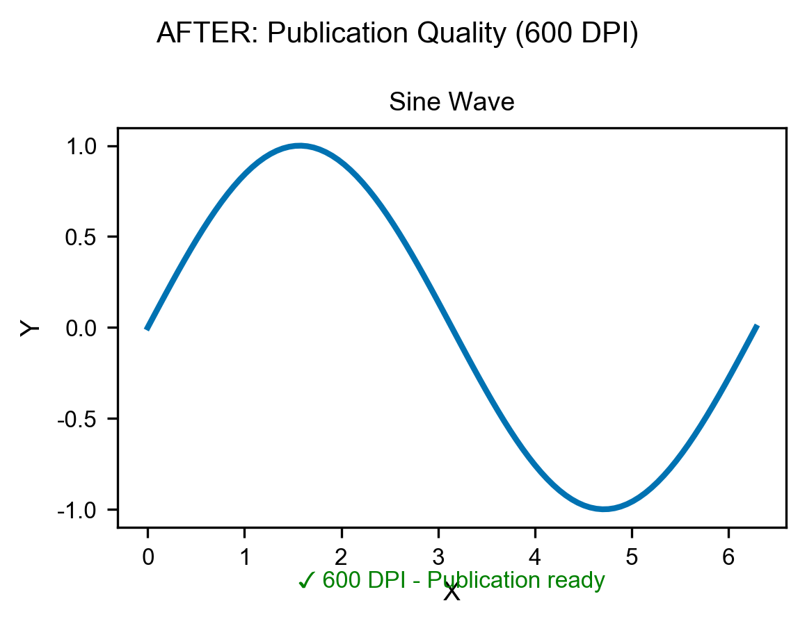 |

### Case 9: Non-Colorblind Safe → Accessible Colors

**Problem**: Red-green colors indistinguishable for ~8% of male readers

| Before | After |
|--------|-------|
| 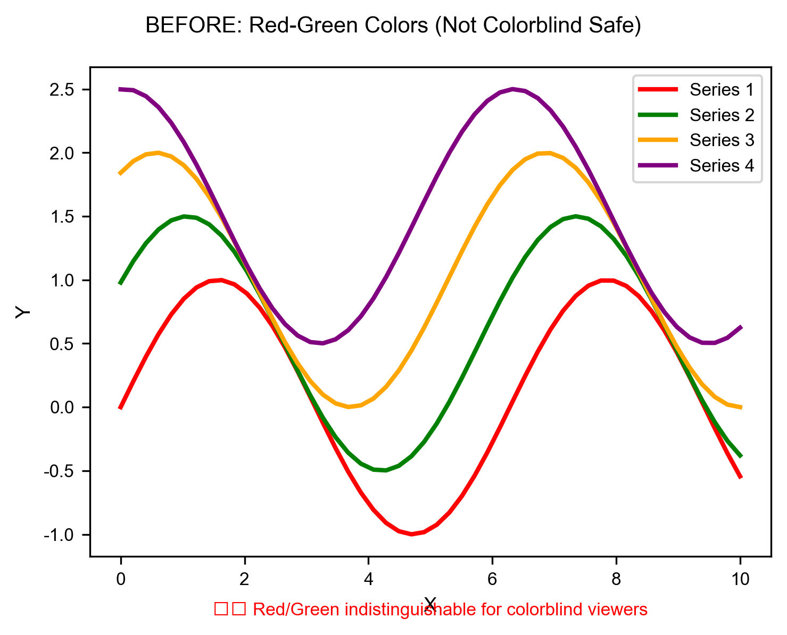 | 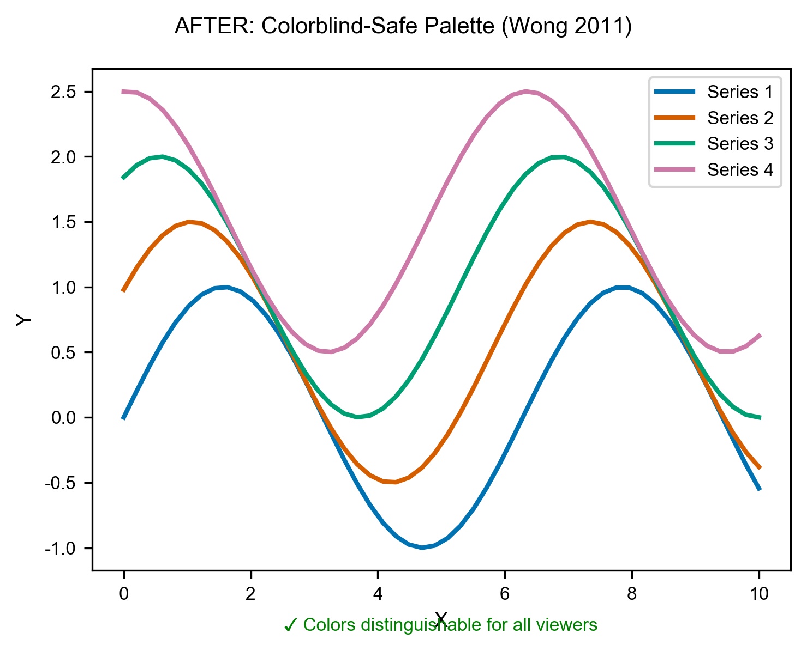 |

> 📖 See [Case Studies Documentation](docs/case-studies.md) for detailed code examples.

## Contributing

Contributions are welcome! Please see [CONTRIBUTING.md](CONTRIBUTING.md) for guidelines.

### Adding Journal Standards

```python
# In src/sci_figure_toolkit/standards/my_journal.py
from .base import JournalStandard

class MyJournalStandard(JournalStandard):
    name = "My Journal"
    width_single = 3.5
    width_double = 7.0
    font_axis = 9
    # ... etc
```

## License

MIT License - see [LICENSE](LICENSE) for details.

## Citation

If you use this toolkit in your research, please cite:

```bibtex
@software{sci_figure_toolkit,
  title = {SCI Figure Toolkit: Publication-Ready Figure Quality Control},
  author = {Your Name},
  year = {2024},
  url = {https://github.com/caizi333333/SCIFIG}
}
```

## Acknowledgments

- Inspired by best practices from Nature, Science, and Cell editorial guidelines
- Built with matplotlib and numpy
- Case studies from real DMA modeling research

---

<p align="center">
  Made with ❤️ for the scientific community
</p>
